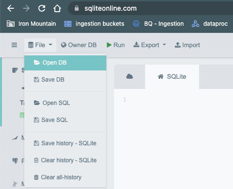

# Interview

## Setup 

The data for this exercise is contained in a SQLITE database that you will need to load. You can do so by:
1. Cloning this repository to your local environment (HTTPS is easiset). 
2. Navigating to [sqliteonline.com](https://sqliteonline.com/)
3. Clicking File > Open DB and uploading the file from this repository "basic_sql_interview/sqlite/interview_exercise.db"

## SQL Exercise
We have an online grocery store. Customers can order grocery items and they receive a bill for their order that looks like this:

Below is a diagram of the relationships of between the tables. 

1) Write a sql statement to show the **exact** table output as shown below
    -All service order headers 

        

    - All service order numbers with the customer name 

        

    - Service order 1234 details 
        - service order number
        - customer name
        - product name
        - qty 
        - price
        - total for the line

        
    - The total amount paid for each service order 

        

    - The max price paid for an Apple

        

2) Look at the details for so_number = 1237. Notice there is only one line item, but it has been updated. 

    

Write a statement to show

- The most recent version of this line item

    
