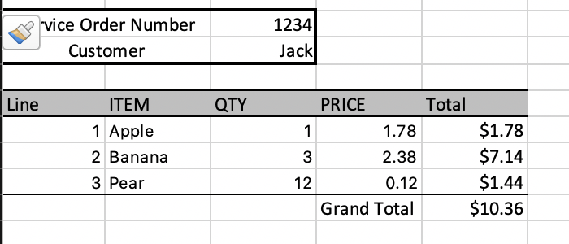
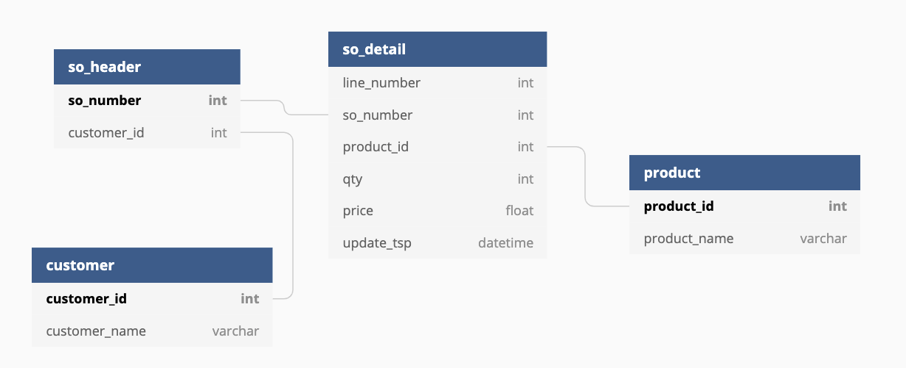
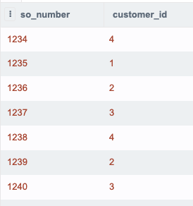
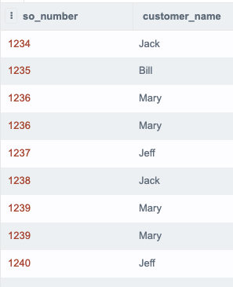
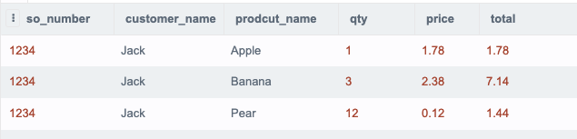
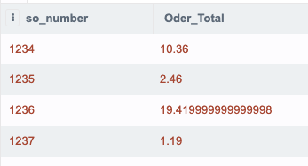
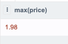
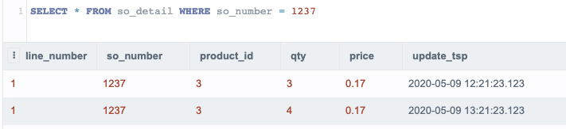
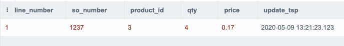

# interviews

## SQL Exercise

We have an online grocery store. Customers can order grocery items and they receive a bill for their order that looks like this:

The data is contained in a SQLITE database. 

You can access the database [here](https://sqliteonline.com/#fiddle=9972873654795311a0d22a1ef056e64353e4b41271de92f929a94f613c17660e).

1) Write a sql statement to show 
    - all service order headers *(hint - simple select)*

        

    - all service order numbers with the customer name *(hint - simple join)*

        

    - service order 1234 details *(hint - multiple joins and a where stmt)*
        - service order number
        - customer name
        - product name
        - qty 
        - price
        - total for the line

        
    - the total invoice price for each service order *(hint - simple aggregation)*

        

    - the max price paid for an Apple

        

2) Look at the details for so_number = 1237. Notice there is only one line item, but it has been updated. 

    

Write a statement to show

- the most recent version of this line item

    
